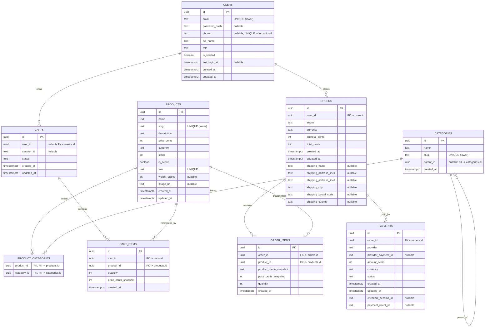

# Database Schema Diagram

This document reflects the current backend schema under `apps/api/migrations`.

## ER Diagram

## Key Constraints

- `users.email` is unique case-insensitively (`LOWER(email)` index).
- `users.phone` is optional, must be normalized E.164 when present, and unique when not null.
- `products.slug` and `categories.slug` are unique case-insensitively.
- `product_categories` uses composite PK (`product_id`, `category_id`) to prevent duplicates.
- Cart ownership is exclusive: exactly one of `user_id` or `session_id` must be set.
- Only one active cart is allowed per user and per session.
- `orders.status` is constrained to: `pending`, `paid`, `failed`, `refunded`, `shipped`.
- Monetary fields enforce non-negative values; `orders.total_cents >= orders.subtotal_cents`.
- If `orders.status = shipped`, core shipping fields are required.
- `payments.status` is constrained to: `pending`, `succeeded`, `failed`, `refunded`.
- `payments` enforces idempotency with unique references on:
  - (`provider`, `provider_payment_id`) when payment id is present
  - `checkout_session_id` when present
  - `payment_intent_id` when present
